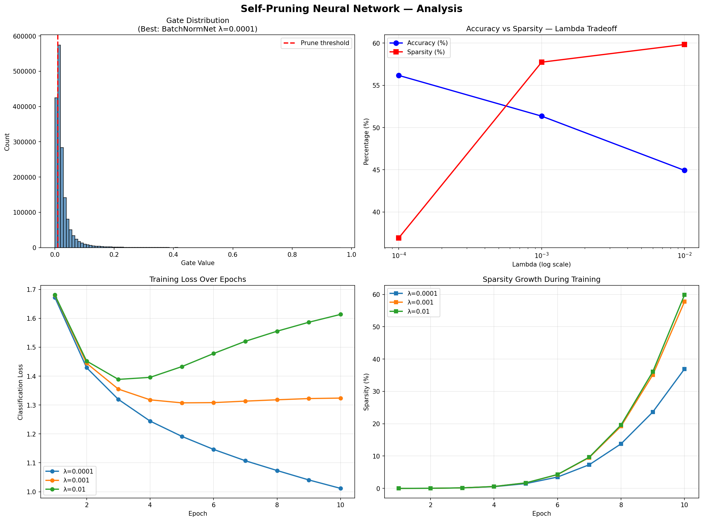

# Self-Pruning Neural Network
> CIFAR-10 classification with learnable gate-based weight pruning

## What This Does
Each weight has a learnable gate parameter. During training, unimportant 
gates get pushed toward 0 (pruned) while important ones survive.

Total Loss = CrossEntropyLoss + λ × sum(sigmoid(gate_scores))

## 3 Approaches I Tested

| Approach | Architecture | Key Idea |
|----------|-------------|----------|
| Baseline | 3072→512→256→10 | Simple flat network |
| DeeperNet | 3072→1024→512→256→10 | Deeper + Dropout |
| BatchNormNet | 3072→512→256→10 + BN | BatchNorm for stable gates |

## Why L1 on Sigmoid Gates Works

Sigmoid keeps all gates between 0 and 1.
L1 penalty applies equal pressure to push every gate down.

- Unimportant weights: gate drops to 0 → weight pruned
- Important weights: gate resists → reducing it hurts accuracy

This is why L1 works better than L2 here — L2 makes values small 
but rarely exactly zero. L1 creates true sparsity.

## Lambda Comparison (BaselineNet)

| Lambda | Test Accuracy | Sparsity |
|--------|--------------|----------|
| 0.0001 | 56.17% | 36.93% |
| 0.001  | 51.35% | 57.73% |
| 0.01   | 44.93% | 59.83% |

## Architecture Comparison (Best Lambda = 0.0001)

| Architecture | Accuracy | Sparsity |
|-------------|----------|----------|
| BaselineNet  | 56.17%   | 36.93%   |
| DeeperNet    | 55.49%   | 42.20%   |
| BatchNormNet | 56.31%   | 25.60%   |

## What I Found

- Higher lambda aggressively prunes but accuracy drops hard —
  λ=0.01 hit 59.83% sparsity but accuracy fell to 44.93%
- λ=0.0001 was the sweet spot — 56.17% accuracy with 36.93% sparsity
- BatchNormNet was the best model overall — same accuracy as baseline
  (56.31%) but lower sparsity (25.60%), meaning it kept more useful weights
- Sparsity grows slowly in early epochs then spikes after epoch 6 —
  visible in the sparsity growth plot
- The gate distribution shows a massive spike near 0 — confirms
  pruning is working correctly

## Analysis Plot

## How to Run
pip install torch torchvision matplotlib numpy
python train.py

## Stack
Python · PyTorch · CIFAR-10 · Custom PrunableLinear · Adam

## Research Paper
Published research paper on climate forecasting included in this repo.
See `research_paper.pdf`
